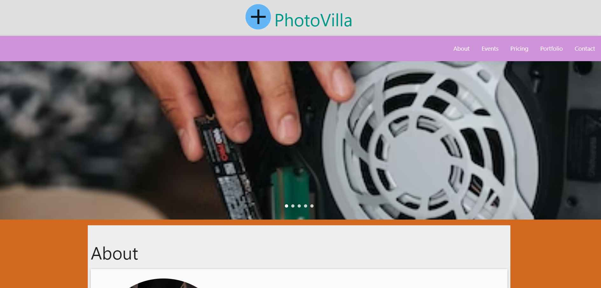
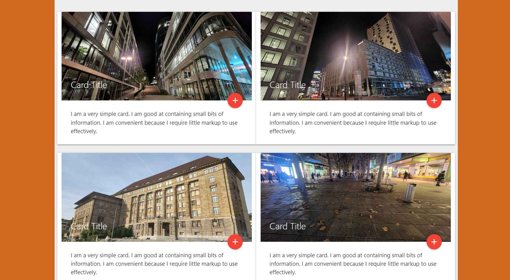

# A simple photo gallery theme in Materialize CSS

This is a simple theme I created once I completed a course on Materialize CSS recently. I gotta say I am pretty satisfied with the 
framework and the ease with which you can work with dynamic JS components like sidebar, modals, icons and more. 

I also liked the color scheme material uses a lot. The forms are nice as well. It would have been better had they provided more utility classes for margins and paddings. I also faced issue in implementing multiple carousels in a single page having different properties. It is easy to overwrite default CSS for materialize unlike with Bootstrap where each style comes with !Important tag
which makes overwriting styles a hassle.

That being said, I definitely prefer Materialize CSS over other similar CSS frameworks under certain situations. It's an amazing framework, would be looking forward to work on it more in future.

Most of the content is filled with Lorem text. I really didn't care to put in some meaningful text which matches the theme of the 
website which is photography, might edit this later.

## Getting Started

You just need to clone the project and run the HTML index file in your browser and you're done.

## Authors

* **Amit Prafulla (APFirebolt)** - [My Website](https://apgiiit.com)

## License

This project is licensed under the MIT License - see the [LICENSE.md](LICENSE.md) file for details

## Screenshots

Below you can find some screenshots of the theme.

